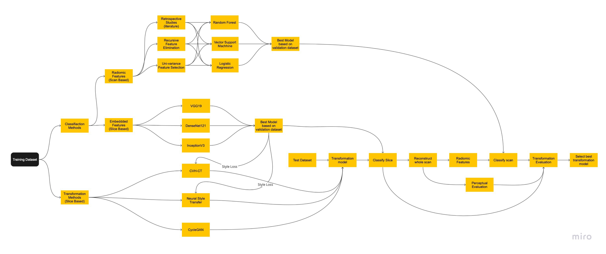

Vendor Classifiaction and Transformation (Tim's Internship)
==========

This project focust on the implementation and trainining of vendor specific transformation and classification models in CT scans. 

The following project workflow was used to build this code:

 

Data Preparation
===
1. Copy all the folders from https://s3.console.aws.amazon.com/s3/buckets/artrya-data-tim-paquay to your own directory. 

2. Make sure to install all the packages based on the requirements.txt

3. Change the base directory in conf_train/data and conf_test/data to the directory where you have stored the data files.

**Note:** Your main directory has now the following folders: scans, checkpoints, dataset, radiomics

4. When using your own data make sure the files are saved in the following way: scans/studyid/seriesid/____.DICOM
Also the dataset files with the corresponding studies need to be saved inside the dataset folder and be built in the following format: 

| series_id    | study_id     | manufacturer          |
| ------------ | -------------| ----------------------|
|  contrastS14 | IDX1_000047  | Canon Medical Systems |
|  contrastS11 | IDX1_000170  | Canon Medical Systems |
|  contrastS23 | IDX1_000360  | Canon Medical Systems |

5. Create tensorflow dataset of the data by using the script make_tf_dataset. 

When using your own data change the dataframe to your own datafile. **Note**: This file consists of all the studies which are being used regardless if they belong to training, testing or validation. This can be done by manually by changing the conf_train/data/data.yaml file. And change the parameter dataframe it can also be done by the following prompt. For using the data used in this research use: data_split.csv

```bash
python make_tf.dataset.py data.data_preparation.dataframe=data_split.csv
```

If your data has different amounts of vendors or has different names make sure to set the encoder to true:

```bash
python make_tf.dataset.py data.data_preparation.dataframe=_____.csv  data.data_preparation.new_encoder=True
```

**Note**: The 3D scan used for radiomic extraction will be automatically saved together with the DICOM files in the scans folder. Furthermore, the TensorFlow dataset will be saved in the scans as well but in a separate folder in the following way: scans/tensors/studyid/seriesid/dataset

6. Make sure to split the data in the correct way. The confiq_train/data/data.yaml consists out of 4 different splits of the data. train, val,domainA, domainB. The split of the data is made by using different csv files with a selection of all the prepared data. **For instance:** dataset_train.csv is the dataset used to train the CNN and the radiomic classifier. Siemens_train.csv is a dataset containing only Siemens scan from the train dataset and was used to train the transformation models. Same for the other vendors. The different datasets can be found in the dataset folder.


Training
=====
6. After preparing the tensorflow dataset and the correct splits, the model can be trained using the following commands:

```bash
python train.py 
```

Manually the config_train/config.yaml file can be changed by selecting different models. But this can also be done by overwriting the config file through a prompt:
```bash
python train.py models=StyleTransfer radiomics=CT selection=RFE CNN=inceptionv3  
```

Overwriting inside the selected models can be done with the following prompt:

```bash
python train.py selection=RFE selection.estimator=DTC 
```
**Note**: This prompt activates the training of the recursive feature elimination with cross-validation with the estimator of a decision tree. It will output the classification score based on the validation dataset. Since the radiomics feature extraction was not selected it loads the radiomics csv which is saved in the radiomics folder.

Testing
====
7.  Inside the s3 bucket also the directories of trained models can be found. These are saved inside checkpoints. 

8. Inside the config_test files the directories of the best-performing models are saved. Except for the StyleTransfer since this can not be saved due to the iterative architecture. Therefore, the right parameters are saved inside the config file and when executed the model will rerun the optimised parameter settings. 

9. The following prompts can be used to calculate the performance of the CNN based on the test dataset.

**Test CNN performance**
```bash
python test.py CNN=inceptionv3
python test.py CNN=DenseNet121
python test.py CNN=VGG19
```
**Test Radiomic Classifier Performance**

**Note:** It takes the radiomics features from the radiomics folder which are the radiomic features from the used datasets. If own data is used radiomics need to be selected.

```bash
python test.py selection=RFE 
python test.py selection=Univariate
python test.py selection=Literature
```
For example, if own dataset is used. The radiomics will be automatically saved in the radiomics folder in the following way: radiomics_(roi-size)_dataset-name.csv

```bash
python test.py radiomics=CT selection=RFE 
python test.py selection=Univariate
python test.py selection=Literature
```

**Note:** If there are already radomics extracted from the dataset and saved you do not have to run the radiomics again when you want to test multiple classifiers. 

For testing the transformation models the following prompt can be executed:

```bash
python test.py models=CVH-CT radiomics=CT selection=RFE CNN=inceptionv3 
python test.py models=CycleGAN radiomics=CT selection=RFE CNN=inceptionv3 
python test.py models=StyleTransfer radiomics=CT selection=RFE CNN=inceptionv3 
```
**Note:** When radiomics are extracted from transformed images these radiomics are **not** saved! So when testing mutiple classifier models based on the transformed scan you have to run the radiomic extraction again.


Results
===
**Classification task Radiomics based on 28 studies:**

|                             |Precision|Recall|f1-Score|
|-----------------------------|---------|------|--------|
|Literature                   |0.79     |0.79  | 0.78   |
|Univariate Feature Selection |0.93     | 0.93 | 0.93   |
|Recursive Feature Elimination| 1.0     | 1.0  | 1.0    |

**Classification task CNN based on 28 studies (8687 slices):**
|             |Precision  | Recall  | f1-Score|
|------------ |-----------|---------|---------|
| VGG19       | 0.15      | 0.38    | 0.21    |
| InceptionV3 | 0.90      | 0.89    | 0.89    |
| DenseNet121 | 0.91      | 0.91    | 0.91    |


**Transformation models:**

**Siemens to GE**

|             | Radiomics  | InceptionV3  | Densenet121|
|------------ |-----------|---------|---------|
| CycleGAN       | 0.00      | 0.00    | 0.04    |
| StyleTransfer | 0.00    | 0.99    | 0.08    |
| CVH-CT | 0.00      | 0.10    | 0.50    |


**GE to Siemens**

|             | Radiomics  | InceptionV3  | Densenet121|
|------------ |-----------|---------|---------|
| CycleGAN       | 0.00     | 0.90    | 0.77    |
| StyleTransfer | 0.00    | 0.61    | 0.00    |
| CVH-CT | 0.00     | 0.64    | 0.09    |
# Vendor-Transformation
# Vendor-Transformation
